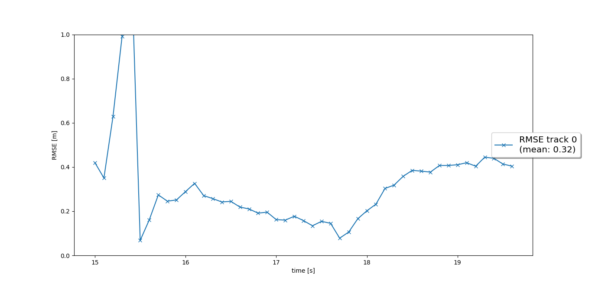
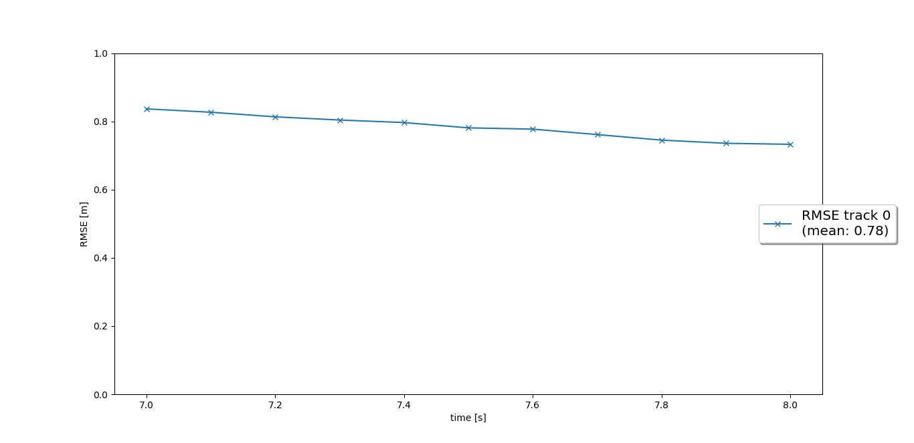
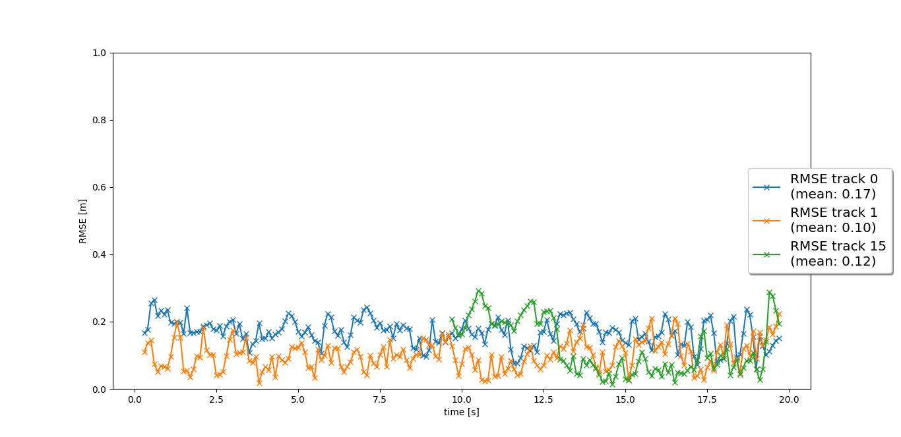

# Writeup: Track 3D-Objects Over Time

Please use this starter template to answer the following questions:

### 1. Write a short recap of the four tracking steps and what you implemented there (filter, track management, association, camera fusion). Which results did you achieve? Which part of the project was most difficult for you to complete, and why?

### 2. Do you see any benefits in camera-lidar fusion compared to lidar-only tracking (in theory and in your concrete results)? 

### 3. Which challenges will a sensor fusion system face in real-life scenarios? Did you see any of these challenges in the project?

### 4. Can you think of ways to improve your tracking results in the future?

### 1:
#### filter.py:
EKF is implemented including appropriate system matrix F and process noise Q for constant velocity motion model.
Step1 result:

#### trackmanagement.py:
Track initialization from unassigned measurements is implemented. Track initialization from unassigned measurements is implemented. Track states are defined and implemented, e.g. “tentative”, “confirmed”. Old tracks are deleted for not updated tracks.

#### association.py:
Nearest neighbor data association including association matrix is implemented. A method that returns nearest track and measurement for association is implemented. Gating method with chi-square-distribution is implemented to reduce complexity.
[[my_tracking_results.avi]](video/my_tracking_results.avi)

#### measurement.py:
It Assosiates track and camera measurement in addition to association between track and Lidar measurement. As result of these tow associations, Lidar detection and Camera detection are fused.

### 1-2: 
I think truck management was little bit harder than other models. I was facing difficulties the algorithm for implementing the code.

### 2:
In theory, camera-lidar fusion is more accorate than the lidar-only tracking. I can see the same result in the implementation also.

### 3:
Tracking or sensor fusion need a few frames to decide that the detection is 'confirmed'.
However, detection latency is very important to avoid collision.
In this project, the same issue can be found.

### 4:
Implementing a more advanced data association, e.g. Global Nearest Neighbor (GNN) or Joint Probabilistic Data Association (JPDA). Using a non-linear motion model, e.g. a bicycle model, which is more appropriate for vehicle movement than our linear motion model, since a vehicle can only move forward or backward, not in any direction.